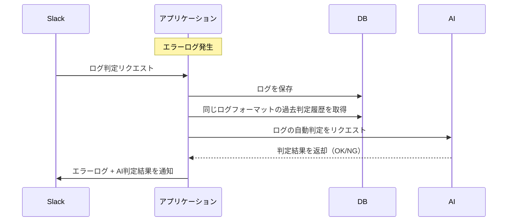
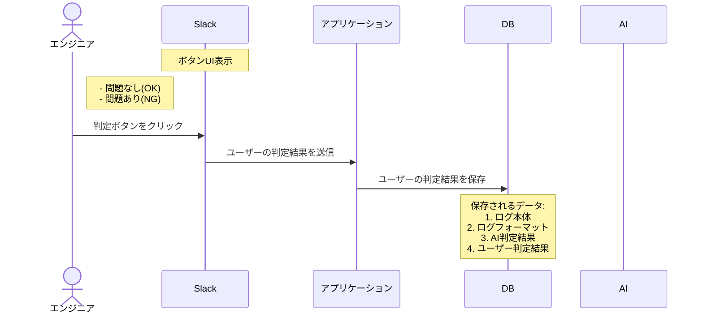

# Design Doc: エラーログ自動判定・一次回答システム

## 1. 概要

アプリケーションから出力されるエラーログを自動判定し、「許容可能か」「クリティカルか」 を一次回答するシステム。
既存の Slack 通知運用を拡張し、ユーザーがログを見た際に「問題ない」「問題あり」 とフィードバックできる UI を提供する。
最終的には、収集したフィードバックをもとに AI モデルの精度向上やログ監視の効率化を図る。

## 2. 目的

- 監視工数の削減
従来すべてのエラーログをエンジニアが手動で確認していたところを、一定のフィルタリング（AI＋ルールベース）により作業を軽減する。
- フィードバックの蓄積
Slack 上でエンジニアが「問題ない」「問題あり」と回答した内容を DB に蓄積し、今後の分析・モデル再学習に活用する。
- クリティカルエラーの早期検知
重要度の高いエラーを逃さずアラートを上げ、対応を促す。

### ログ判定フロー

### データ蓄積フロー

